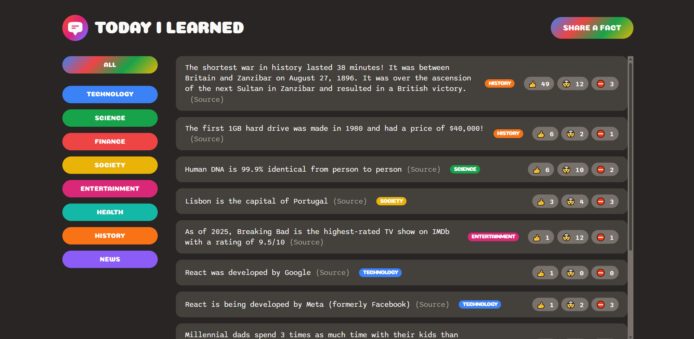

# Today I Learned App

[Today I Learned live demo](https://todayilearned-kerompo.netlify.app/)

The app was created as part of the **Crash Course: Build a Full-Stack Web App in a Weekend** course on [Udemy](https://www.udemy.com/course/full-stack-crash-course/). The course instructor is [Jonas Schmedtmann](https://www.udemy.com/user/jonasschmedtmann/).

## App description

Main goal of the app is to allow users to learn new facts that they didn't know before. The main part of the app is a list of facts created by users of this application.

Facts that users input are saved in a database (Supabase) on a live server.



## Features

- Add new fact to the list and upload it to a database
- Filter facts by categories 
- Vote on facts and highlight disputed facts

## Technologies Used

- HTML/CSS
- JavaScript
- React
- Supabase
- Netlify


## How to run locally

- Clone the repo and switch to folder
```js
git clone https://github.com/mker/facts-learning-app.git
cd facts-learning-app
```

- Install dependencies
```js
npm install
```

- Start local server
```js
npm start
```
Open [http://localhost:3000](http://localhost:3000) to view it in your browser.

